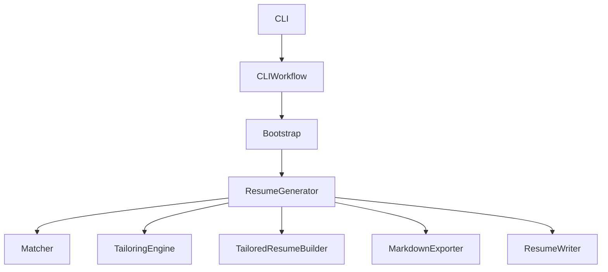
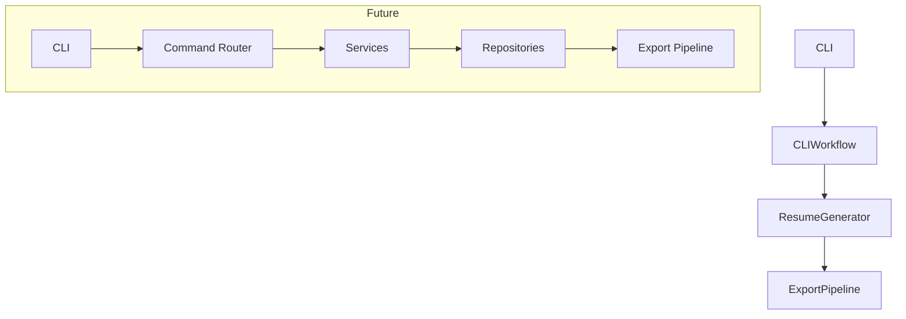

# ResumeForge

> 🚧 ResumeForge is currently in active alpha development. Core functionality is stable and protected by a comprehensive automated test suite while new features are added incrementally.

[](https://www.python.org/)
[](https://github.com/jkljabo/ResumeForge/actions)
[](LICENSE)
[](docs/ROADMAP.md)

ResumeForge is a modular, AI-assisted resume tailoring and generation platform written in Python.

It analyzes job descriptions, matches them against reusable resume profiles, tailors resume content for Applicant Tracking Systems (ATS), and generates polished resumes using configurable templates, themes, and export pipelines.

## Why ResumeForge?

ResumeForge helps software engineers efficiently tailor resumes for specific job descriptions while maintaining reusable resume profiles, improving ATS alignment, and generating professional output from a single source of truth. Its modular architecture separates resume analysis, tailoring, rendering, and exporting into independent components, making it easy to extend with new templates, exporters, and AI-assisted features.

---

## Core Workflow

ResumeForge processes resumes through a predictable pipeline:

Job Description
        │
        ▼
Keyword Analysis
        │
        ▼
Resume Matching
        │
        ▼
Tailoring Engine
        │
        ▼
Resume Builder
        │
        ▼
Renderer
        │
        ▼
Markdown / DOCX Output

---

## Table of Contents

- [Why ResumeForge?](#why-resumeforge)
- [Architecture](#high-level-architecture)
- [Project Structure](#project-structure)
- [Design Goals](#design-goals)
- [Features](#features)
- [Installation](#installation)
- [Quick Start](#quick-start)
- [Command Line](#command-line)
- [Testing](#testing)
- [Project Status](#project-status)
- [Roadmap](#roadmap)
- [Contributing](#contributing)
- [License](#license)

---

## Technology Stack

### Core
- Python 3.13
- argparse

### Rendering
- python-docx
- Markdown

### Testing
- pytest

### Packaging
- pyproject.toml
- setuptools

### Documentation
- Mermaid

### CI/CD (Planned)
- GitHub Actions

### Architecture
- Dependency Injection
- Repository Pattern (in progress)
- Command Pattern (in progress)

---

## High-Level Architecture



---

## Project Structure

The project structure above is simplified to highlight the major packages. Additional supporting modules, tests, and documentation are omitted for clarity.

```
resumeforge/
    bootstrap.py
    cli.py
    workflow.py
    generator.py
    profile_creator.py
    loader.py

    exporters/
    output/
    profiles/
    rendering/
    services/
    scoring/
    tailoring/
    templates/
    themes/
    
tests/
docs/
```

---

## Current Design



---

## Design Principles

ResumeForge is built around:

• Separation of Concerns
• Single Responsibility Principle
• Dependency Injection
• Test-Driven Development
• Extensible Architecture
• Reusable Resume Profiles
• Minimal External Dependencies

---

## Development Principles

ResumeForge follows a strict test-first workflow.

Each feature is developed using the following process:

1. Write failing tests
2. Implement the smallest working solution
3. Refactor while keeping tests green
4. Update documentation
5. Verify the complete test suite

This approach has allowed the project to grow while maintaining a stable codebase and comprehensive regression coverage.

---

## Development Workflow

```powershell
python -m venv .venv
.\.venv\Scripts\Activate.ps1
python -m pip install -r requirements.txt
python -m pytest
python -m build --no-isolation
```

---

## Features

### Resume Tailoring

- ATS keyword analysis
- Resume scoring
- AI-assisted tailoring
- Tailored resume generation

### Output

- Markdown export
- DOCX export
- Export pipeline

### Profile Management

- Multiple resume profiles
- Profile creation
- Profile selection

### Architecture

- Modular workflow
- Dependency injection
- Installable CLI
- 273+ automated tests

---

## Supported Output Formats

| Format         | Status        |
|----------------|---------------|
| Markdown       | ✅            |
| DOCX           | ✅            |
| HTML           | 🚧 Planned    |
| PDF            | 🚧 Planned    |

## Requirements

- Python 3.13+
- Virtual environment

---

## Installation

### Clone the repository

```powershell
git clone https://github.com/jkljabo/ResumeForge.git
cd ResumeForge
```

### Create a virtual environment

```powershell
python -m venv .venv
.\.venv\Scripts\Activate.ps1
```

### Install dependencies

```powershell
python -m pip install -r requirements.txt
python -m pip install -e .
```

This installs ResumeForge in editable mode, allowing local code changes to be reflected immediately.

### Run tests

```powershell
python -m pytest
```
---

## Quick Start

The command creates a tailored resume using the specified resume profile and job description.

```powershell
python -m pip install -e .

resumeforge profile create default

resumeforge generate ^
    --profile default ^
    --job jobs/backend.txt ^
    --output resume.docx
```

This installs the `resumeforge` command so it can be run from the command line during development.

---

## Legacy Compatibility

```powershell
python build_resume.py
```

The legacy build_resume.py script remains available for compatibility with earlier releases. New development should use the resumeforge CLI.

---

## Command Line

### Available Commands

| Command        | Description                |
| -------------- | -------------------------- |
| generate       | Generate a tailored resume |
| profile create | Create a profile           |
| profile list   | List profiles              |
| profile remove | Delete a profile           |


Display available options:

```powershell
resumeforge --help
resumeforge generate --help
resumeforge profile --help

resumeforge generate \
    --profile default \
    --job jobs/backend.txt \
    --output resume.docx
```

Legacy:

```
python build_resume.py
```

This remains available for backward compatibility.

## Profile Management

ResumeForge supports multiple resume profiles, allowing you to maintain separate versions of your resume for different industries, clients, or career paths while keeping a single, reusable source of truth.

Common use cases include:

- Government positions
- Financial services
- Healthcare
- Consulting
- General software engineering

### Create a profile

```powershell
resumeforge profile create government
```

### List profiles

```powershell
resumeforge profile list
```

### Edit a profile

```powershell
resumeforge profile edit government \
    --headline "Senior Software Engineer"
```

### Remove a profile

```powershell
resumeforge profile remove government
```

### Generate a tailored resume

```powershell
resumeforge generate \
    --profile government \
    --job jobs/backend.txt \
    --output government_resume.docx
```

### Import a profile

```powershell
resumeforge profile import government.json
```

### Export a profile

```powershell
resumeforge profile export government
```

---

## Testing

Run the full test suite:

```powershell
python -m pytest
```

Run a subset of tests:

```
python -m pytest tests/test_cli.py
```

Current Quality Metrics

- ✅ 273 automated unit and integration tests
- ✅ 100% passing
- ✅ CLI workflow tests
- ✅ Profile management tests
- ✅ Resume generation tests
- ✅ Rendering and export tests
- ✅ Regression coverage

---

## Verify Project

Runs the standard project validation checks including:

- pytest
- packaging verification
- project structure validation

```powershell
.\verify-project.ps1
```

---

## Packaging

```powershell
python -m build --no-isolation
```

Creates

- Wheel (.whl)
- Source Distribution (.tar.gz)

Artifacts are written to:

dist/

- resumeforge-x.y.z-py3-none-any.whl
- resumeforge-x.y.z.tar.gz

Install the generated wheel with:

```powershell
pip install dist/resumeforge-x.y.z-py3-none-any.whl
```

The generated wheel can be installed locally or uploaded to a package repository.

---

## Versioning

ResumeForge follows semantic versioning while in active development.

Current release:
v0.1.2-alpha

Breaking changes may occur until the first stable release.

---

## Release Philosophy

ResumeForge follows an incremental, test-first development process. Each completed phase is validated with automated tests before new functionality is introduced, ensuring that architectural improvements do not compromise existing behavior.

---

## Current Capabilities

ResumeForge currently supports:

- Resume generation from reusable profiles
- ATS-aware tailoring
- Multiple resume profiles
- Profile creation
- Profile listing
- Profile removal
- Markdown export
- DOCX export
- Modular CLI command architecture
- Test-first architecture with 273 automated tests
- Installable command-line interface

---

## Project Status

| Item         | Status                             |
| ------------ | ---------------------------------- |
| Version      | v0.1.2-alpha                       |
| Phase        | G.1.9 — Profile Editing (Completed)|
| Tests        | 273 Passing                        |
| Test Coverage| 273 automated tests                |
| Python       | 3.13                               |
| Architecture | Modular CLI / Workflow / Generator |
| Packaging    | Complete                           |
| Profiles     | Create • List • Remove             |

ResumeForge is currently in active alpha development. New features are added incrementally while maintaining a fully passing automated test suite.

---

## Roadmap

### Completed

- ✅ Resume domain model
- ✅ ATS matching engine
- ✅ Resume tailoring engine
- ✅ Markdown export
- ✅ DOCX export
- ✅ Export pipeline
- ✅ Installable CLI
- ✅ Multiple resume profiles
- ✅ Profile creation
- ✅ Profile listing
- ✅ Profile removal
- ✅ Profile editing
- ✅ Modern Python packaging
- ✅ 273+ automated tests

### Current Phase (G.1.9)

- ✅ Profile editing

### Planned

- ✅ Profile editing

### Long-Term Vision

- ☐ Additional Templates
- ☐ Additional Themes
- ☐ PDF Export
- ☐ HTML Export
- ☐ LinkedIn Export
- ☐ AI-generated summaries
- ☐ Skill recommendation engine

---

## Acknowledgements

ResumeForge is developed as an open-source learning and productivity project focused on modern Python architecture, clean code principles, and automated testing.

---

## Contributing

Contributions are welcome.

See CONTRIBUTING.md for development setup, coding standards, testing requirements, and commit conventions.

---

## License

MIT License

Copyright (c) 2026 Jason Little (jkljabo)

## Links

- [Repository](https://github.com/jkljabo/ResumeForge)
- [Releases](https://github.com/jkljabo/ResumeForge/releases)
- [Issues](https://github.com/jkljabo/ResumeForge/issues)
- [Documentation](docs/DOCUMENTATION.md)
- [Architecture Guide](docs/ARCHITECTURE.md)
- [Roadmap](docs/ROADMAP.md)
- [Contributing Guide](CONTRIBUTING.md)
- [License](LICENSE)