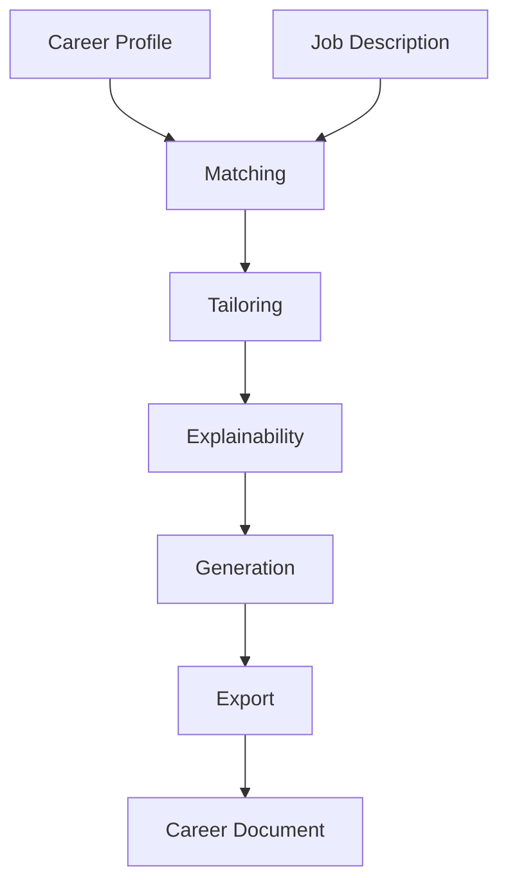
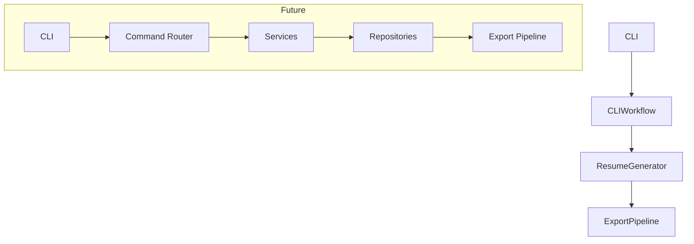

# ResumeForge

> **ResumeForge is a deterministic career document platform that transforms a reusable career profile into tailored, explainable application materials through modular workflows and extensible generators.**

> 🚧 ResumeForge is under active development and is protected by a comprehensive automated test suite. New capabilities are introduced through incremental, test-first development while maintaining a stable architecture.

[](https://www.python.org/)
[](https://github.com/jkljabo/ResumeForge/actions)
[](LICENSE)
[](docs/ROADMAP.md)

ResumeForge helps professionals maintain a single reusable career profile and generate tailored application materials for specific opportunities.

**Build once. Tailor everywhere.**

By separating career data from presentation, ResumeForge provides a single source of truth for generating consistent, explainable application materials across multiple opportunities.

Its deterministic matching engine identifies the most relevant skills, experience, certifications, education, and projects for a target position. An explainability engine documents why tailoring decisions were made, providing transparency and confidence in every tailoring decision.

The platform is built around modular workflows and extensible generators, allowing document generation, rendering, exporting, and future AI-assisted capabilities to evolve independently while sharing a common domain model.

## Key Capabilities

ResumeForge is built around a reusable **Career Profile**, the single source of truth for generating tailored career documents. Its modular architecture emphasizes deterministic behavior, transparency, and extensibility.

### 👤 Career Profiles

Maintain a single reusable Career Profile containing your professional experience, skills, education, certifications, and projects. Generate multiple career documents from the same trusted source.

### 🎯 Deterministic Tailoring

Tailor documents for specific opportunities using repeatable matching and prioritization workflows. ResumeForge produces consistent results from the same inputs, making behavior predictable and testable.

### 💡 Explainable Decisions

Every tailoring decision can be explained. ResumeForge records why skills, experience, certifications, and projects were promoted, retained, or deprioritized, providing transparency throughout the tailoring process.

### 📄 Modular Document Generation

Generate tailored career documents through extensible generation workflows that separate matching, tailoring, formatting, rendering, and exporting into independent components.

### 🧩 Extensible Architecture

Protocols, dependency injection, and modular services make it easy to add new document generators, exporters, workflows, or rendering strategies without affecting the core domain model.

### 🧪 Test-First Development

ResumeForge evolves through comprehensive automated testing, ensuring new features are introduced with confidence while preserving deterministic behavior.

---

## Core Workflow

ResumeForge processes **career documents** through a predictable pipeline:

Career Profile      (Domain)
        │
        ▼
Job Description     (Input)
        │
        ▼
Matching            (Analysis)
        │
        ▼
Tailoring           (Selection)
        │
        ▼
Explainability      (Reasoning)
        │
        ▼
Generation          (Construction)
        │
        ▼
Export              (Output)
        │
        ▼
Career Document     (Result)

Each stage has a single responsibility, allowing matching, tailoring, explainability, document generation, and exporting to evolve independently while sharing a common domain model.

---

## Table of Contents

- [Key Capabilities](#key-capabilities)
- [Core Workflow](#core-workflow)
- [Technology Stack](technology-stack)
- [Project Structure](#project-structure)
- [Features](#features)
- [Installation](#installation)
- [Quick Start](#quick-start)
- [Profile Management](profile-management)
- [Testing](#testing)
- [Project Status](#project-status)
- [Roadmap](#roadmap)
- [Contributing](#contributing)
- [License](#license)

---

## Technology Stack

### Core
- Python 3.13
- argparse

### Rendering
- python-docx
- Markdown

### Testing
- pytest

### Packaging
- pyproject.toml
- setuptools

### Documentation
- Mermaid

### CI/CD
- GitHub Actions

### Architectural Patterns
- Dependency Injection
- Repository Pattern
- Command Pattern

---

## High-Level Architecture

The following diagram illustrates the conceptual processing pipeline. It intentionally emphasizes the domain workflow rather than implementation classes.



---

## Project Structure

The project structure below is intentionally simplified to highlight the primary packages and architectural boundaries. Supporting modules, tests, and implementation details are omitted for clarity.

```
resumeforge/
    bootstrap.py
    cli.py
    workflow.py
    generator.py
    profile_creator.py
    loader.py

    exporters/
    output/
    profiles/
    rendering/
    services/
    scoring/
    tailoring/
    templates/
    themes/
    
tests/
docs/
    ARCHITECTURE.md
    ROADMAP.md
```

---

## Architectural Evolution

The architecture continues to evolve through incremental, test-first refactoring toward increasingly modular services while preserving deterministic behavior and backward compatibility.



---

## Design Principles

ResumeForge is built around:

• Reusable Career Profiles
• Separation of Concerns
• Single Responsibility
• Dependency Injection
• Extensible Architecture
• Test-Driven Development
• Minimal External Dependencies


---

## Development Principles

ResumeForge follows a strict test-first workflow.

Each feature is developed using the following process:

1. Write failing tests
2. Implement the smallest working solution
3. Refactor while keeping tests green
4. Update documentation
5. Verify the complete test suite

This approach has allowed the project to grow while maintaining a stable codebase and comprehensive regression coverage.

---

## Development Workflow

```powershell
python -m venv .venv
.\.venv\Scripts\Activate.ps1
python -m pip install -r requirements.txt
python -m pytest
python -m build --no-isolation
resumeforge --help
```

Every feature in ResumeForge follows a consistent engineering workflow:

1. Define the story.
2. Write failing tests.
3. Implement the minimum code to satisfy the tests.
4. Refactor while maintaining a passing test suite.
5. Update project documentation.
6. Review code and documentation.
7. Sign off.
8. Commit.

### Story Completion & Review Process

Every implementation story follows the same review cadence before code is committed.

1. Complete the implementation.
2. Verify the automated test suite passes.
3. Update all affected documentation (for example, `README.md` and `CHECKPOINT.md`).
4. Create a WIP checkpoint archive containing the current project state.
5. Review the implementation using the WIP checkpoint as the authoritative source.
6. Address any review feedback.
7. Perform final signoff.
8. Commit the completed story.

Using the WIP checkpoint as the review artifact ensures that code, documentation, architecture, and project status remain synchronized before every commit.

---

## Features

### Document Tailoring

- ATS keyword analysis
- Match scoring
- AI-assisted tailoring
- Tailored document generation

### Output

- Markdown export
- DOCX export
- Export pipeline

### Profile Management

- Multiple Career Profiles
- Profile creation
- Profile editing
- Profile listing
- Profile removal
- Profile selection

### Architecture

- Modular workflow
- Dependency injection
- Installable CLI
- 379+ automated tests

---

## Supported Output Formats

| Format         | Status        |
|----------------|---------------|
| Markdown       | ✅            |
| DOCX           | ✅            |
| HTML           | 🚧 Planned    |
| PDF            | 🚧 Planned    |

## Requirements

- Python 3.13+
- Virtual environment

---

## Installation

### Clone the repository

```powershell
git clone https://github.com/jkljabo/ResumeForge.git
cd ResumeForge
```

### Create a virtual environment

```powershell
python -m venv .venv
.\.venv\Scripts\Activate.ps1
```

### Install dependencies

```powershell
python -m pip install -r requirements.txt
python -m pip install -e .
```

This installs ResumeForge in editable mode, allowing local code changes to be reflected immediately.

### Run tests

```powershell
python -m pytest
```
---

## Quick Start

The command generates a tailored career document using the specified **Career Profile** and job description.

```powershell
python -m pip install -e .

resumeforge profile create default

resumeforge generate ^
    --profile default ^
    --job jobs/backend.txt ^
    --output resume.docx
```

This installs the `resumeforge` command so it can be run from the command line during development.

---

## Legacy Compatibility

```powershell
python build_resume.py
```

The legacy build_resume.py script remains available for compatibility with earlier releases. New development should use the resumeforge CLI.

---

## Command Line

### Available Commands

| Command        | Description                         |
| -------------- | ----------------------------------- |
| generate       | Generate a tailored career document |
| profile create | Create a profile                    |
| profile list   | List profiles                       |
| profile remove | Delete a profile                    |
| config show    | Displays configuration              |
| config set     | Sets configuration                  |


Display available options:

```powershell
resumeforge --help
resumeforge generate --help
resumeforge profile --help

resumeforge generate \
    --profile default \
    --job jobs/backend.txt \
    --output resume.docx
```

Legacy:

```
python build_resume.py
```

This remains available for backward compatibility.

## Profile Management

ResumeForge supports multiple Career Profiles, allowing you to maintain separate versions of your resume for different industries, clients, or career paths while keeping a single, reusable source of truth.

Common use cases include:

- Government positions
- Financial services
- Healthcare
- Consulting
- General software engineering

A Career Profile represents a reusable professional identity from which multiple tailored documents can be generated.

### Create a profile

```powershell
resumeforge profile create government
```

### List profiles

```powershell
resumeforge profile list
```

### Edit a profile

```powershell
resumeforge profile edit government \
    --headline "Senior Software Engineer"
```

### Remove a profile

```powershell
resumeforge profile remove government
```

### Generate a tailored document

```powershell
resumeforge generate \
    --profile government \
    --job jobs/backend.txt \
    --output government_resume.docx
```

### Import a profile

```powershell
resumeforge profile import government.json
```

### Export a profile

```powershell
resumeforge profile export government
```

### Configuration Commands

Display the current ResumeForge application configuration.

```powershell
resumeforge config show
```

Example output:

```text
ResumeForge Configuration
-------------------------
Default Profile         : resume
Default Theme           : default
Output Directory        : ...
Default Output Filename : ...
Page Size               : ...
Font Name               : ...
```

Set the current ResumeForge application configuration.

```powershell
resumeforge config set default-profile developer
```

```text
Configuration updated.

resumeforge config show

ResumeForge Configuration
-------------------------
Default Profile         : developer
...
```

---

## Testing

Run the full test suite:

```powershell
python -m pytest
```

Run a subset of tests:

```
python -m pytest tests/test_cli.py
```

Current Quality Metrics

- ✅ 379 automated unit and integration tests
- ✅ 100% passing
- ✅ CLI workflow tests
- ✅ Profile management tests
- ✅ Resume generation tests
- ✅ Rendering and export tests
- ✅ Regression coverage

---

## Verify Project

Runs the standard project validation checks including:

- pytest
- packaging verification
- project structure validation

```powershell
.\verify-project.ps1
```

---

## Packaging

```powershell
python -m build --no-isolation
```

Creates

- Wheel (.whl)
- Source Distribution (.tar.gz)

Artifacts are written to:

dist/

- resumeforge-x.y.z-py3-none-any.whl
- resumeforge-x.y.z.tar.gz

Install the generated wheel with:

```powershell
pip install dist/resumeforge-x.y.z-py3-none-any.whl
```

The generated wheel can be installed locally or uploaded to a package repository.

---

## Versioning

ResumeForge follows semantic versioning while in active development.

Current release:
v0.1.2-alpha

Development Branch:
main

Latest Tag:
v0.1.2-alpha

Breaking changes may occur until the first stable release.

---

## Release Philosophy

ResumeForge follows an incremental, test-first development process. Each completed phase is validated with automated tests before new functionality is introduced, ensuring that architectural improvements do not compromise existing behavior.

---

## Current Capabilities

ResumeForge currently supports:

Generation
- Career document generation
- ATS-aware tailoring
- Markdown export
- DOCX export

Profile Management
- Create
- List
- Remove
- Multiple Career Profiles

Architecture
- Modular CLI
- Test-first architecture
- Installable command-line interface

---

## Project Status

| Item         | Status                                                     |
| ------------ | ---------------------------------------------------------- |
| Version      | v0.1.2-alpha                                               |
| Phase        | See CHECKPOINT.md for the current active development phase.|
| Tests        | 379 Passing                                                |
| Test Coverage| 379 automated tests                                        |
| Python       | 3.13                                                       |
| Architecture | Modular CLI / Workflow / Generator                         |
| Packaging    | Complete                                                   |
| Profiles     | Create • Edit • List • Remove                              |

ResumeForge is currently in active alpha development. New features are added incrementally while maintaining a fully passing automated test suite.

---

## Roadmap

### Completed

- ✅ Resume domain model
- ✅ ATS matching engine
- ✅ Resume tailoring engine
- ✅ Markdown export
- ✅ DOCX export
- ✅ Export pipeline
- ✅ Installable CLI
- ✅ Multiple resume profiles
- ✅ Profile creation
- ✅ Profile listing
- ✅ Profile removal
- ✅ Profile editing
- ✅ Modern Python packaging
- ✅ 379+ automated tests

### Active Development

See CHECKPOINT.md for the current implementation status and active stories.

### Future Milestones

See CHECKPOINT.md for upcoming planned work.

### Long-Term Vision

- ☐ Additional Templates
- ☐ Additional Themes
- ☐ PDF Export
- ☐ HTML Export
- ☐ LinkedIn Export
- ☐ AI-generated summaries
- ☐ Skill recommendation engine

ResumeForge is being developed incrementally with a strong emphasis on deterministic behavior, testability, and maintainable architecture. Each milestone expands the platform while preserving backward compatibility and code quality.

---

## Acknowledgements

ResumeForge is developed as an open-source learning and productivity project focused on modern Python architecture, clean code principles, and automated testing.

---

## Engineering Principles

ResumeForge is developed using a disciplined, test-first engineering process.

- Story-driven development
- Test-driven implementation
- Small, incremental changes
- Documentation updated with every completed story
- Code and documentation reviewed before every commit
- Passing automated test suite required for signoff
- Architecture evolves through small, verified milestones

The goal is for every commit to represent a stable, documented, and production-quality checkpoint.

## Contributing

Contributions are welcome.

See CONTRIBUTING.md for development setup, coding standards, testing requirements, and commit conventions.

---

## License

MIT License

Copyright (c) 2026 Jason Little (jkljabo)

## Links

- [Repository](https://github.com/jkljabo/ResumeForge)
- [Releases](https://github.com/jkljabo/ResumeForge/releases)
- [Issues](https://github.com/jkljabo/ResumeForge/issues)
- [Documentation](docs/DOCUMENTATION.md)
- [Architecture Guide](docs/ARCHITECTURE.md)
- [Roadmap](docs/ROADMAP.md)
- [Contributing Guide](CONTRIBUTING.md)
- [License](LICENSE)